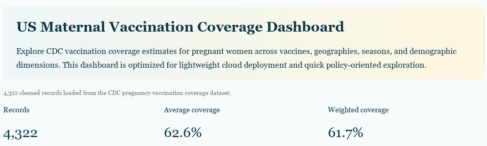
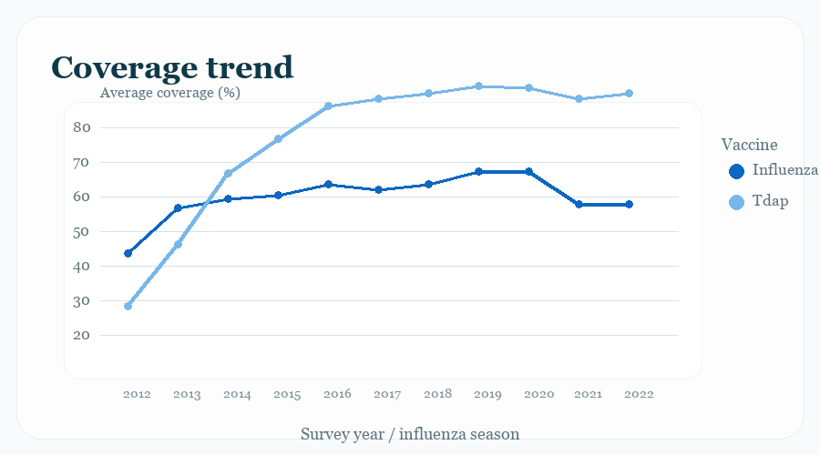
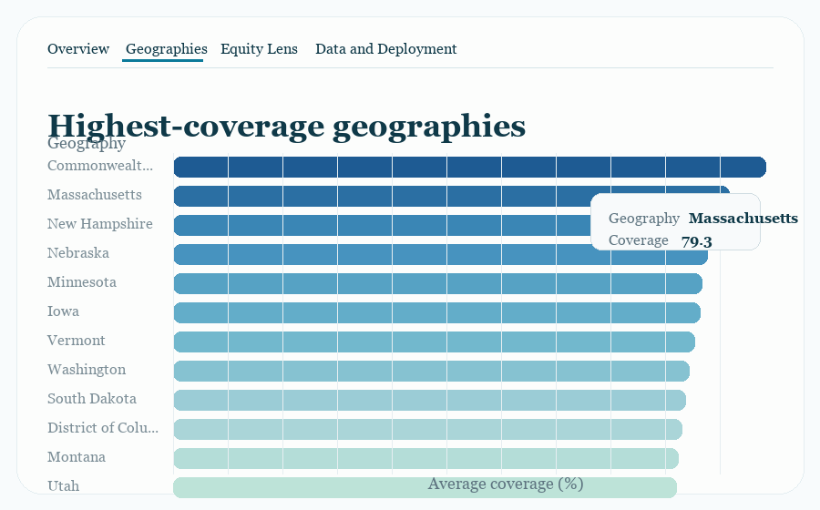
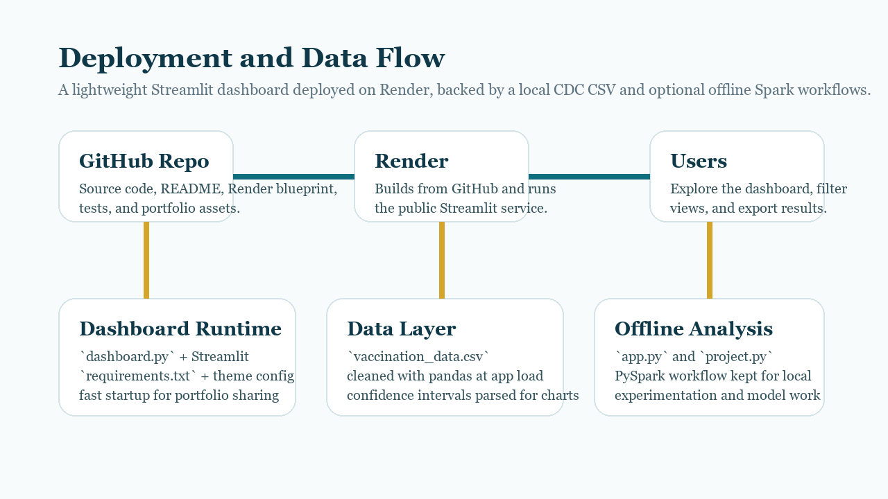

# Vaccination Coverage Dashboard for Pregnant Women in the US

[](https://vaccination-coverage-dashboard.onrender.com/)

This repository now ships with a deployment-ready Streamlit dashboard for exploring maternal vaccination coverage in the United States, backed by the [CDC Pregnancy Vaccination Coverage dataset](https://data.cdc.gov/Pregnancy-Vaccination/Vaccination-Coverage-among-Pregnant-Women/h7pm-wmjc/about_data).

[](https://github.com/andyombogo/vaccination-coverage-analysis-usa/actions/workflows/ci.yml)
[](https://vaccination-coverage-dashboard.onrender.com/)
[](https://render.com/deploy?repo=https://github.com/andyombogo/vaccination-coverage-analysis-usa/tree/master)

## Live Demo

- Public app: https://vaccination-coverage-dashboard.onrender.com/
- Deployment platform: Render
- Repo: https://github.com/andyombogo/vaccination-coverage-analysis-usa

## Why this repo is worth using

- Fast deployed experience: the public app uses pandas and Streamlit for quick cold starts.
- Better exploration flow: filters, KPI cards, trend views, subgroup gap analysis, and CSV export.
- Reproducible deployment: `render.yaml`, `Dockerfile`, and a consistent Streamlit theme are all included.
- Deeper analysis preserved: Spark scripts still exist for offline experimentation and model work.

## Portfolio Highlights

- Solves a real deployment problem by separating the lightweight deployed dashboard from heavier local Spark workflows.
- Presents public health data in a clearer, more interactive format than a notebook or static report.
- Includes a live cloud deployment, reproducible infrastructure, and a cleaner GitHub presentation path.
- Adds CI-backed tests so the public app feels maintained, not just uploaded.

## Screenshots

These README previews are based on the strongest views from the live app:

### Coverage trend

[](https://vaccination-coverage-dashboard.onrender.com/#coverage-trend)

### Highest-coverage geographies

[](https://vaccination-coverage-dashboard.onrender.com/#highest-coverage-geographies)

For future README image additions, use the naming guidance in [docs/screenshots/README.md](docs/screenshots/README.md).

## Project Story

This project started with a useful dataset and deployment ambition, but the original hosting approach launched batch-style Python scripts instead of a real web service. That made the app fail on platforms that expect an HTTP process bound to `PORT`.

The repo now has a cleaner shape for both hiring managers and collaborators:

- a live Render deployment built from a lightweight Streamlit dashboard
- preserved Spark scripts for deeper local analysis
- clearer GitHub documentation and portfolio assets
- automated CI to keep the deployable path healthy

## Architecture



The deployed path is intentionally simple:

- GitHub stores the app, docs, CI workflow, and Render blueprint.
- Render builds the Python service from `requirements.txt` and `render.yaml`.
- Streamlit serves the dashboard, reading from the included CDC CSV.
- Heavier Spark exploration stays available locally through `app.py` and `project.py`.

## What was improved

- Added a dedicated web dashboard in `dashboard.py` with filters, KPIs, trend charts, geography comparisons, and CSV export.
- Kept the existing Spark scripts for offline analysis instead of forcing heavy PySpark startup in production.
- Replaced the stale Heroku-oriented deployment path with a Render Blueprint in `render.yaml`.
- Updated the Docker image so it starts a real web service that binds to `PORT`.
- Split lightweight deployment dependencies from optional analysis dependencies.

## Why the previous deployment failed

The old deployment files started `python app.py` or `python project.py`. Those scripts run batch analysis logic, but they do not start an HTTP server or bind to the platform-assigned `PORT`. On platforms such as Heroku or Render, that causes the service to fail health checks or time out during port detection.

This repo now deploys the Streamlit dashboard instead:

```sh
streamlit run dashboard.py --server.address 0.0.0.0 --server.port $PORT
```

## Project layout

- `dashboard.py`: Lightweight Streamlit dashboard intended for deployment.
- `.streamlit/config.toml`: Shared Streamlit theme and server settings.
- `.github/workflows/ci.yml`: GitHub Actions smoke-test workflow for dashboard helpers.
- `tests/test_dashboard.py`: Lightweight unit tests for the deployed dashboard logic.
- `scripts/generate_readme_assets.py`: Rebuilds the PNG README visuals used on GitHub.
- `docs/assets/dashboard-hero-preview.png`: Cleaner top-of-README hero image based on the live dashboard.
- `docs/assets/project-banner.svg`: Alternate visual banner asset for other portfolio surfaces.
- `docs/assets/architecture.png`: Architecture diagram showing the deployed and offline paths.
- `docs/assets/coverage-trend-preview.png`: README preview image for the live trend chart view.
- `docs/assets/geographies-preview.png`: README preview image for the live geographies tab view.
- `docs/portfolio-checklist.md`: Suggested next steps for turning the repo into a portfolio-quality project.
- `docs/screenshots/README.md`: Naming convention and capture guidance for README screenshots.
- `app.py`: Spark-based command-line summary script.
- `project.py`: Extended Spark EDA and model-training workflow for local experimentation.
- `requirements.txt`: Minimal dependencies for the deployed dashboard.
- `requirements-analysis.txt`: Optional heavier dependencies for Spark analysis.
- `render.yaml`: Render Blueprint for one-click cloud deployment.
- `Dockerfile`: Containerized deployment option for Docker-compatible platforms.
- `LICENSE`: MIT license for reuse and contribution clarity.

## Local quick start

1. Clone the repository:

   ```sh
   git clone https://github.com/andyombogo/vaccination-coverage-analysis-usa.git
   cd vaccination-coverage-analysis-usa
   ```

2. Create and activate a virtual environment:

   ```sh
   python -m venv .venv
   .venv\Scripts\activate
   ```

   On macOS or Linux:

   ```sh
   source .venv/bin/activate
   ```

3. Install dashboard dependencies:

   ```sh
   pip install -r requirements.txt
   ```

4. Run the dashboard:

   ```sh
   streamlit run dashboard.py
   ```

5. Open `http://localhost:8501`.

## Quality Checks

Run the dashboard helper tests locally:

```sh
python -m unittest discover -s tests -p "test_*.py" -v
```

GitHub Actions runs the same test suite on every push to `master` and on pull requests.

## Optional Spark analysis workflow

If you want the offline PySpark scripts as well:

```sh
pip install -r requirements-analysis.txt
python app.py
python project.py
```

## Deploy on Render

1. Push this repository to GitHub.
2. Click the `Deploy to Render` button above, or in Render choose `New +` and then `Blueprint`.
3. Connect the GitHub repository and select this project.
4. Render will detect `render.yaml` and create the web service automatically.
5. After the build completes, open the generated `.onrender.com` URL.

Render uses this configuration:

```yaml
services:
  - type: web
    runtime: python
    buildCommand: pip install -r requirements.txt
    startCommand: streamlit run dashboard.py --server.address 0.0.0.0 --server.port $PORT
```

If you want a shareable public link, the only missing step is creating the service in a Render account. The live URL is assigned by Render during that first deploy.

This project is now live at `https://vaccination-coverage-dashboard.onrender.com/`.

## Deploy with Docker

For any Docker-friendly platform:

```sh
docker build -t vaccination-coverage-dashboard .
docker run -p 8501:8501 vaccination-coverage-dashboard
```

## Data source

- Source: CDC Pregnancy Vaccination Coverage dataset
- File included in repo: `vaccination_data.csv`

## License

This project is available under the MIT License. See `LICENSE`.

## Contributing

Issues and pull requests are welcome. For collaboration or questions, contact `andyombogo@gmail.com`.
